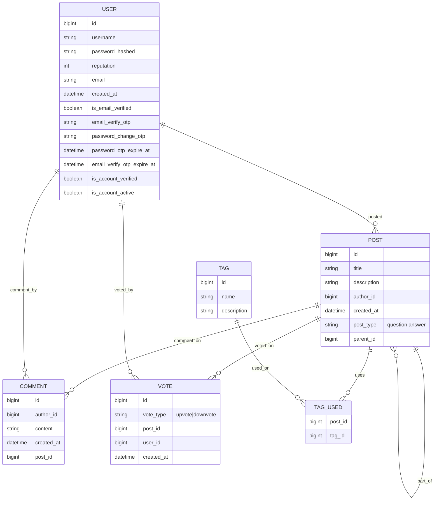

# HearMeOut Backend – Q&A Platform

HearMeOut is a StackOverflow-style Q&A backend built using Spring Boot and Spring Data JPA. It provides APIs for creating questions, posting answers, commenting, and voting, following a clean layered architecture.

This project demonstrates how to implement a production-style REST API with a structured architecture including controllers, services, repositories, DTOs, and global exception handling.

---

## Features

- Post and Comment management (create, read, update, delete)
- Tag management with auto-creation
- Vote tracking per user per post
- User management with reputation tracking
- Single-table design for Questions and Answers using a post_type discriminator
- DTO layer for clean API responses
- Global exception handling with consistent API response wrapper
- Data validation using Jakarta Bean Validation

---

## Tech Stack

- **Backend:** Spring Boot, Spring Data JPA
- **Language:** Java
- **Database:** MySQL/PostgreSQL (later)
- **Build Tool:** Maven
- **API Style:** RESTful APIs

---

## Project Structure

```text
HearMeOut_Backend/
├─ pom.xml
├─ mvnw
├─ mvnw.cmd
├─ .mvn/
├─ src/
│  ├─ main/
│  │  ├─ java/com/project/hearmeout_backend/
│  │  │  └─ service/
│  │  │  └─ controller/
│  │  │  └─ repository/
│  │  │  └─ model/
│  │  │  └─ dto/
│  │  │  └─ exception/
│  │  │  └─ HearMeOutBackendApplication.java
│  │  └─ resources/
│  └─ test/
└─ .gitignore
```

---

## Domain Model (ER Diagram)



---

## Getting Started

### 1️. Clone the repository

```bash
git clone https://github.com/rarestpreet/HearMeOut_Backend.git
```

### 2️. Set environment variables

Configure the required environment variables:

(upcoming commits)
- `DB_URL`
- `DB_USER`
- `DB_PASS`
- `SECRET_KEY`
- `MAIL_USER`
- `MAIL_PASS`

### 3️. Run the application

Run the main class:

- `HearMeOutBackendApplication.java`

Server will start at:

- `http://localhost:8080`

---
